# Performance Analysis

This document provides a detailed performance analysis of each parallel algorithm implemented in the project.

## Methodology

Performance measurements are conducted through the following approach:

1. **Timing Mechanism**: MPI_Wtime() function used for high-precision timing
2. **Metrics Collected**:
   - Execution time (wall clock time)
   - Input size
   - Number of processes
   - Speedup (relative to sequential execution)
   - Efficiency (speedup divided by number of processes)

## Algorithm-Specific Performance Analysis

### Quick Search

- **Computational Complexity**: O(n/p)
- **Communication Complexity**: O(log p)
- **Memory Requirements**: O(n/p) per process

#### Graph

**Time Graphs:**
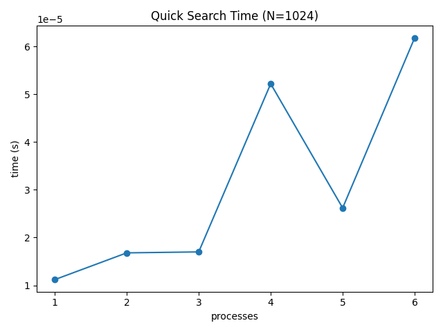


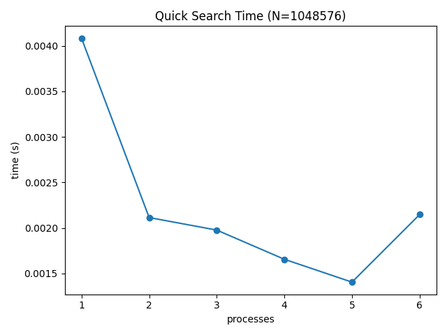

**Speedup & Efficiency Graphs:**

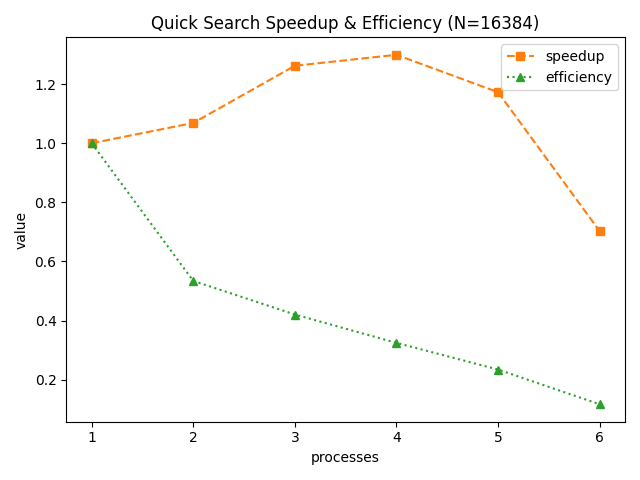

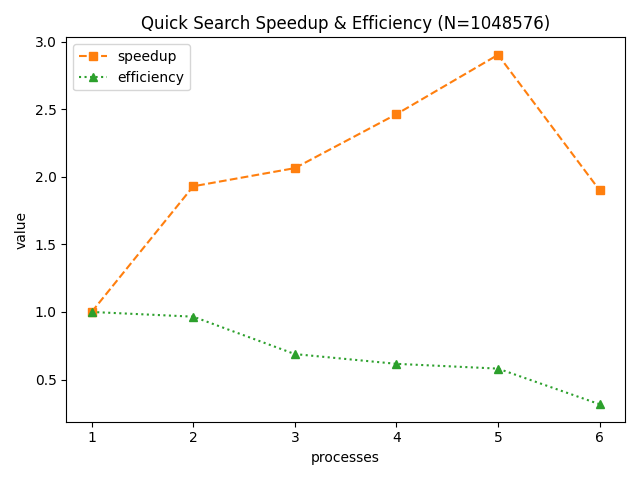

### Prime Number Finding

- **Computational Complexity**: O((m/p) \* √n)
- **Communication Complexity**: O(p + k) where k is the number of primes found
- **Memory Requirements**: O(k/p + m/p) per process

#### Graph

**Time Graphs:**
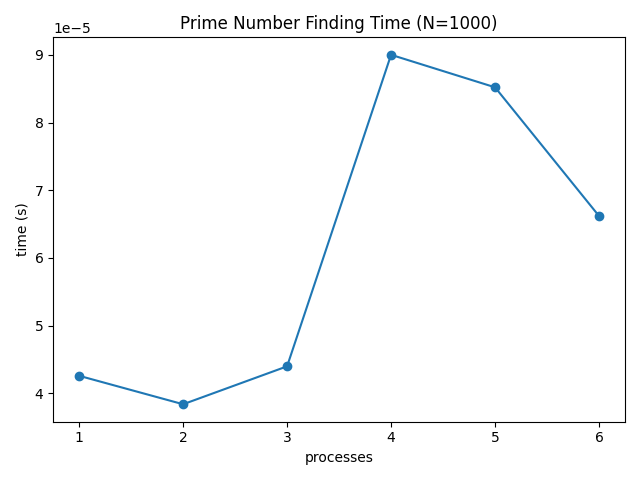
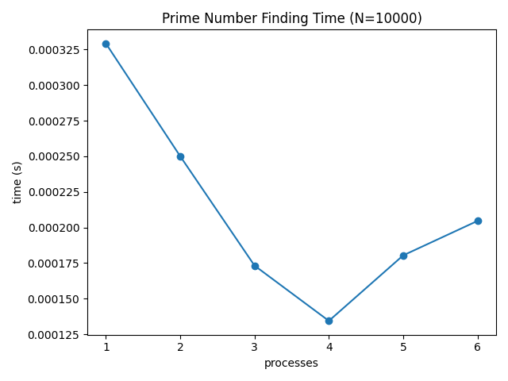
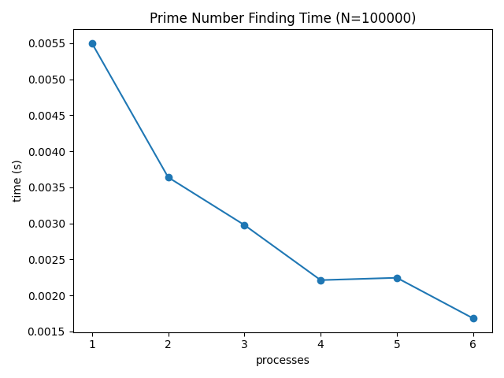
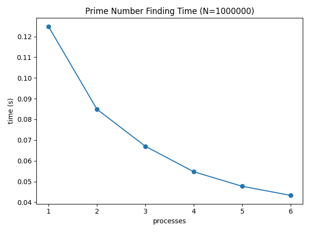

**Speedup & Efficiency Graphs:**
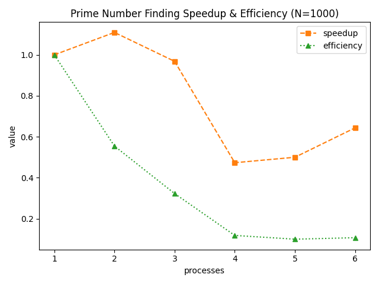
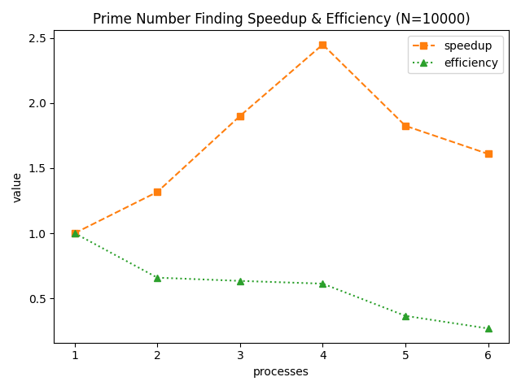


### Bitonic Sort

- **Computational Complexity**: O((n/p) log² n)
- **Communication Complexity**: O((n/p) log p)
- **Memory Requirements**: O(n/p) per process

#### Graph

**Time Graphs:**
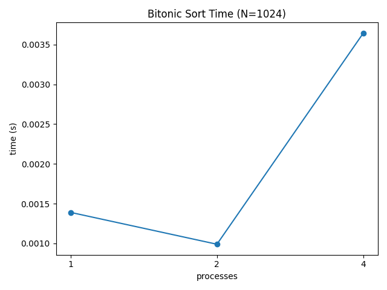

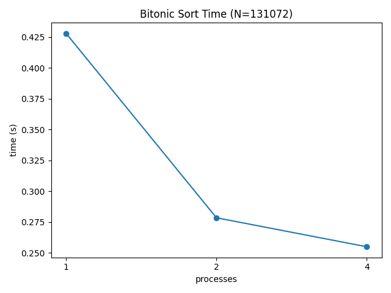
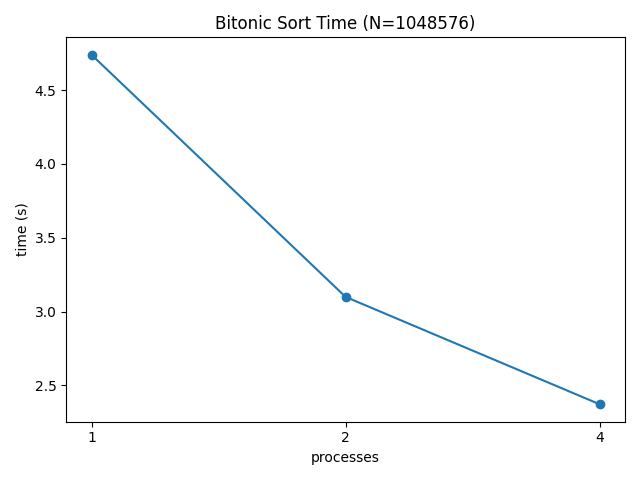

**Speedup & Efficiency Graphs:**
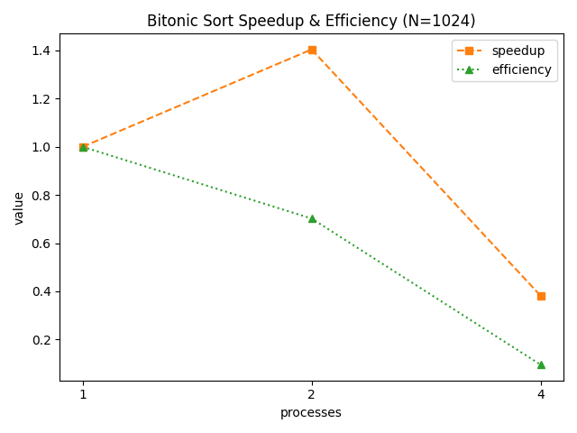
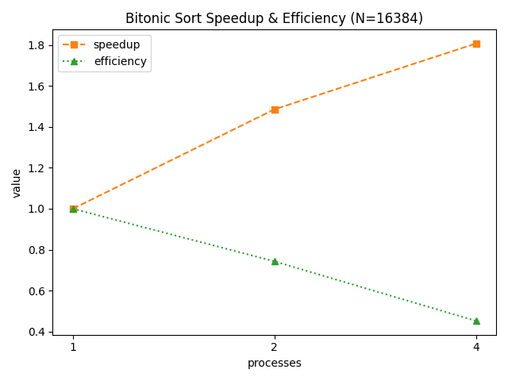
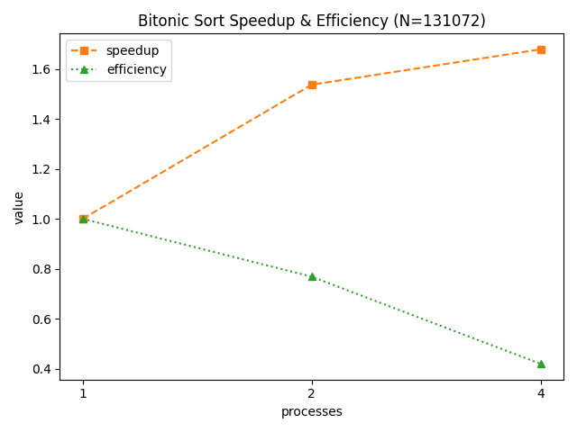
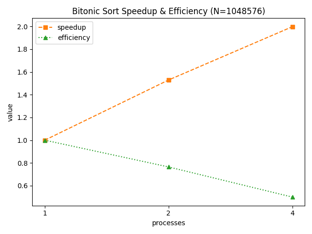

### Radix Sort

- **Computational Complexity**: O((n/p) \* d)
- **Communication Complexity**: O(p + d)
- **Memory Requirements**: O(n/p) per process

#### Graph

**Time Graphs:**


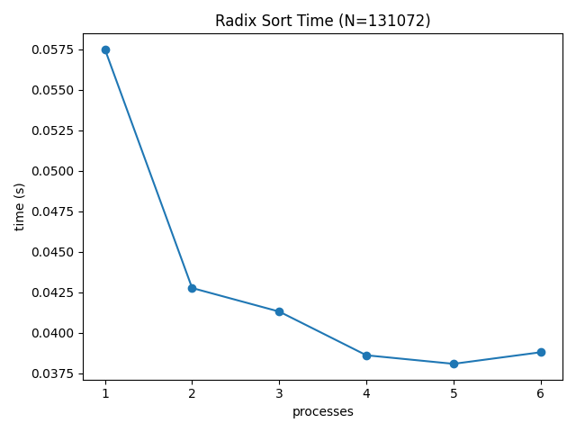
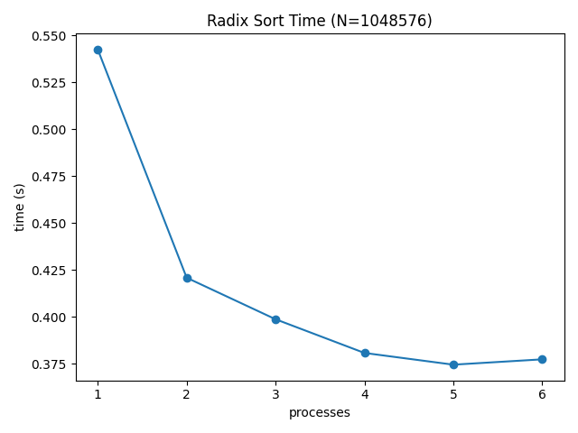

**Speedup & Efficiency Graphs:**
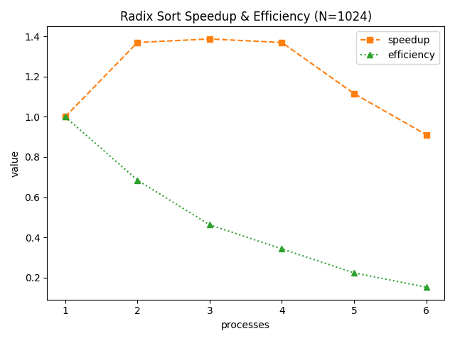
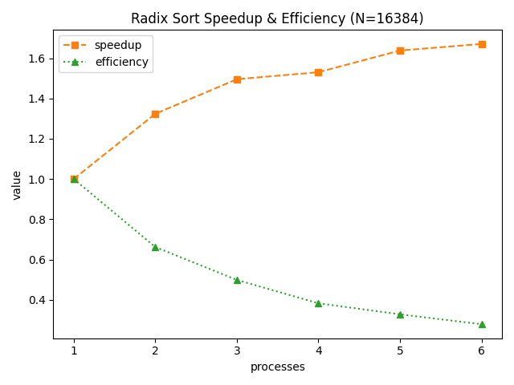
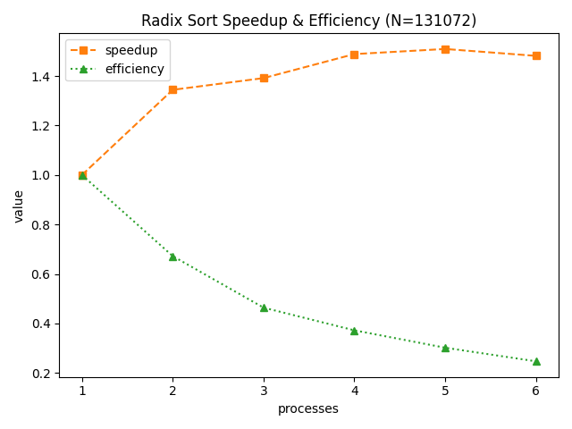
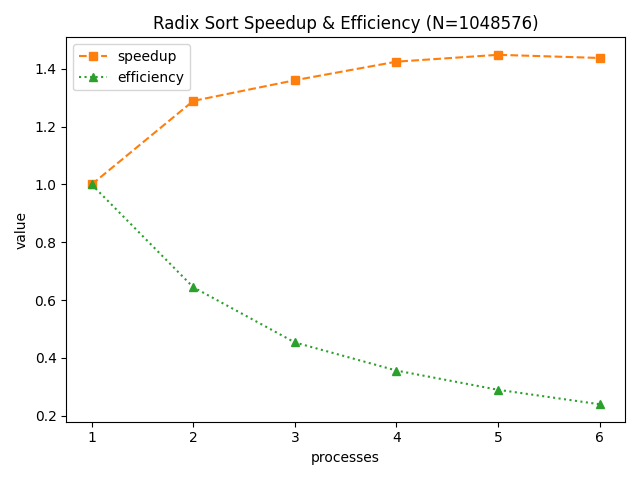

### Sample Sort

- **Computational Complexity**: O((n/p) log(n/p) + p² log p)
- **Communication Complexity**: O(p² + n/p)
- **Memory Requirements**: O(n/p) per process

#### Graph

**Time Graphs:**
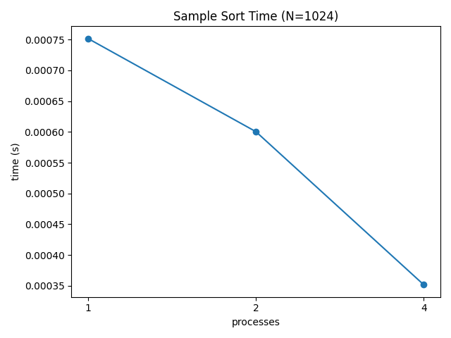


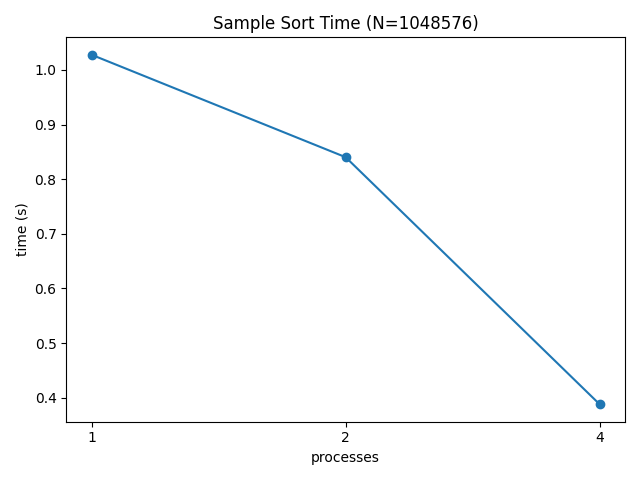

**Speedup & Efficiency Graphs:**

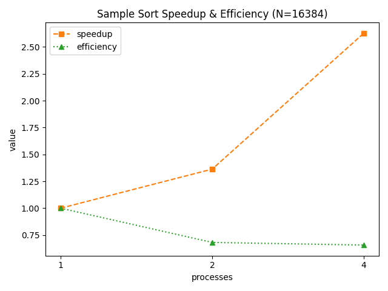


## Performance Bottlenecks

1. **Load Imbalance**:

   - Prime finding can experience imbalance if prime distribution is uneven
   - Sorting algorithms may suffer if data has unique characteristics

2. **Communication Overhead**:

   - All-to-all communication in Sample Sort becomes costly with high process counts
   - Butterfly pattern in Bitonic Sort requires more communication rounds as process count increases

3. **Synchronization Points**:
   - Barriers and collective operations can limit scaling
   - Particularly impacted by process straggling

## Performance Optimization Opportunities

1. **Algorithm-Level Optimizations**:

   - Hybrid approach for Prime Finding (Sieve + Division Testing)
   - Optimized local sort algorithms for Sample Sort

2. **Communication Optimizations**:

   - Overlapping computation with communication
   - Reducing communication frequency

3. **Load Balancing Improvements**:
   - Dynamic work distribution
   - Predictive data decomposition based on statistical properties

## Conclusions

- Quick Search and Prime Finding show the best scaling performance
- Sample Sort provides the best overall sorting performance for general-case data
- Bitonic Sort excels when both data size and process count are powers of two
- Radix Sort is most efficient for data with limited digit range

The performance analysis demonstrates the trade-offs between computational efficiency, communication overhead, and algorithm complexity. Future work should focus on optimizing the communication patterns and load balancing strategies.

## How to Collect Performance Data

To automatically collect performance data and generate graphs for all algorithms and configurations, use the Python analysis script:

```bash
python3 ../performance_analysis.py
```

This script will:

- Generate input data in `docs/input/`
- Compile and run each algorithm multiple times (controlled by `N_TRIALS` in the script)
- Parse timing output (via `analyzeAndPrintPerformance` in C++ code)
- Save time plots and speedup/efficiency graphs in `docs/imgs/`

Ensure you have activated the Python virtual environment and installed the required dependencies as described in the project README.

If you need to run custom experiments, you can still call the `analyzeAndPrintPerformance` function directly in your C++ code and manually collect the results.
